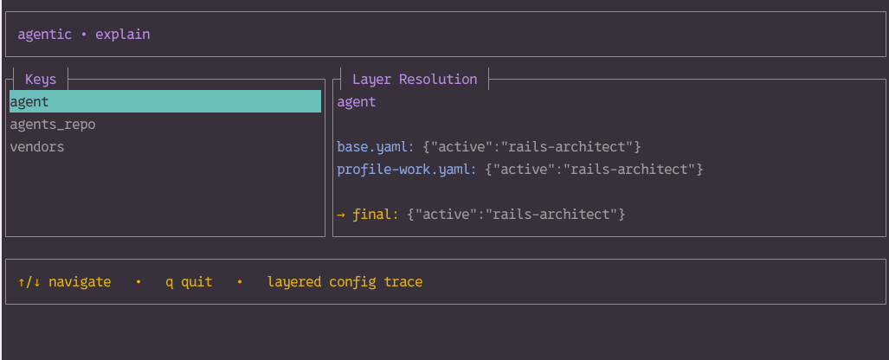

# ai-config

Canonical configuration and agent definitions for AI tooling powered by `agentic`.

This repository defines:

- Layered configuration
- Reusable agents
- Modular skills
- Machine + profile overrides

It does **not** contain vendor runtime configs or secrets.

`agentic` compiles this repository into vendor-specific configurations (Claude, Codex, etc.) on each machine.

# Philosophy

This repo treats AI behavior as infrastructure:

- Deterministic
- Layered
- Portable
- Version-controlled
- Testable

Prompts are not scattered across machines. They are compiled from source.

# Structure

```
ai-config/
│
├── layers/ # Layered configuration
├── agents/ # Agent + skill definitions
├── examples/ # Example project overrides
└── README.md
```

# Layering Model

Configuration merges in this order:

1. `layers/base.yaml`
2. `layers/profile-<name>.yaml`
3. `layers/machine-<hostname>.yaml`
4. project-level `agentic.yaml` (optional)

Later layers override earlier ones.

Objects deep-merge.
Arrays normally override.
Special arrays (e.g., `agents`) merge by `name`.

# Agents & Skills

Agents define:

- system prompt
- skill modules
- optional metadata

Skills are Markdown modules with optional YAML frontmatter.

Agents reference skills by slug. During compliation:

- Agent system prompt loads first
- Skills are concatenated in order
- Local overrides append last

# Example Usage

From this repo:

```
agentic build --profile work
```

From anywhere:

```
agentic build --layers ~/github/ai-config-repo/layers --profile personal
```

Print resolved prompt:

```
agentic print --resolved
```

Interactive explain:



```
agentic build --profile work --explain
```

# Profiles

Profiles allow behavioral shifts without duplicating agents.

Example:

- `profile-work.yaml` → strict, deterministic, low temperature
- `profile-personal.yaml` → creative, higher temperature

Profiles should only change configuration,
not redefine agents.

# Machines

Machine layers allow per-host overrides.

Examples:

- Enable shell tools on dev laptop
- Restrict tool access on work machine
- Adjust vendor model per hardware capability

Machine layers should never contain secrets.

# Project Overrides

A project can include:

```
agentic.yaml
```

Which becomes the highest-priority layer.

Use this to:

- Switch active agent
- Append system prompt rules
- Adjust vendor config for a specific repo

Project configs should be small and specific.

---

# Adding a New Agent

1. Create `agents/agents/<name>.yaml`
2. Reference skill slugs
3. Add new skills under `agents/skills/`
4. Commit
5. Use via profile or project override

---

# Testing Configuration

Validate configuration:

```
agentic validate --layers ./layers
```

Explain resolution:

```
agentic build --profile work --explain
```

# Design Principles

- No duplicated prompts
- No vendor-specific logic here
- No secrets
- Explicit overrides
- Deterministic output

If behavior changes, it should be visible in version control.

# Roadmap

Future improvements:

- Agent version pinning
- Lockfile for resolved bundles
- CI validation
- Snapshot tests for prompt bundles
- Structured explain output
- Cross-repo project presets

# Related

- `agentic` – config compiler
- Local vendor config directories (Claude, Codex)